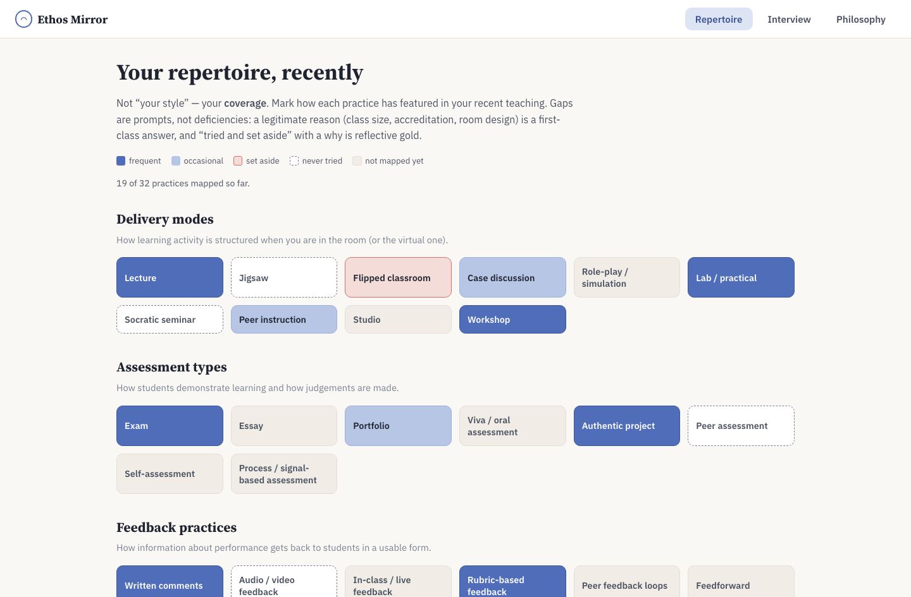

# Ethos Mirror

*Reflect on your practice, build your philosophy.*

A reflection instrument for educators: map your real teaching repertoire, surface tensions between what you value and what you do, and build a teaching philosophy statement grounded in evidence — for promotion, teaching awards and fellowship applications, without the blank page.

**Try it now: https://michael-borck.github.io/ethos-mirror/** — runs entirely in your browser (GitHub Pages, no server). Everything works except AI drafting, which needs the desktop app or a self-hosted instance with an LLM configured; without one the builder uses scaffold mode.



## Not another teaching-style quiz

Tools that output "you are a Facilitator type" are learning styles for teachers: weak evidence, self-fulfilling labels, and permission slips to avoid unfamiliar methods. Ethos Mirror inverts the framing — from *identity* ("what kind of teacher are you") to *repertoire and reasoning* ("what do you actually do, why, and where are the gaps").

**Every output is a mirror plus a question, never a verdict.**

- No types, archetypes, personas or style labels anywhere
- Heat maps carry the temporal frame "recently" and "so far", never "you are"
- Every gap prompt includes a legitimate-reasons escape hatch (constraints and deliberate choices are first-class answers)
- Nothing is scored, ranked, or usable as a performance metric by a third party

## Features

1. **Repertoire map** — a structured self-audit across delivery modes, assessment types, feedback practices, AI-integration stances and inclusion practices. Output is a heat map, not a label: frequently used / occasionally used / never tried / tried and set aside (with a "why" field, because abandonment reasons are reflective gold). Every cell doubles as a short PD explainer with a low-risk way to trial the practice.
2. **Scenario interview** — seven situational prompts ("a student challenges you mid-lecture — walk through what you do"). Free-text answers reveal reasoning patterns far better than Likert scales, and become quotable raw material for the philosophy statement.
3. **Philosophy statement builder** — a structured first draft (beliefs, enactment, evidence, growth) where **every claim links back to its evidence**: a repertoire entry or an interview answer. Works two ways:
   - **AI-assisted** (bring your own LLM): drafts from your material only, with evidence references validated against your actual data
   - **Scaffold mode** (no AI): your own words organised into the four-section structure
4. **Markdown export** — download the draft with a full evidence appendix, ready to rework for a promotion case, award nomination or AdvanceHE fellowship application.

## Privacy by design

- All reflection data lives **in your browser** (localStorage). The server is stateless and stores nothing.
- The only network call is the optional LLM drafting request, which sends your material to whatever endpoint *you* configured — including a fully local Ollama.
- Export is entirely under your control.

## Quick start (development)

```bash
npm install
npm run build:core
npm run dev:server   # API on :3001
npm run dev:web      # Vite dev server on :5173 (proxies /api)
```

Production build and run:

```bash
npm run build
npm start            # serves app + API on :3001
```

## Deploy with Docker

```bash
cp .env.example .env   # optional: configure an LLM
docker compose up -d --build
# → http://localhost:3000
```

With a bundled local Ollama (no external AI service at all):

```bash
docker compose --profile local-ai up -d
docker compose exec ollama ollama pull llama3.2
# set LLM_BASE_URL=http://ollama:11434/v1 and LLM_MODEL=llama3.2 in .env, then:
docker compose up -d app
```

For a VPS behind a reverse proxy, use `deploy/docker-compose.yml`, which pulls the prebuilt image `ghcr.io/michael-borck/ethos-mirror:latest` (published automatically from `main` and version tags).

## Desktop app (Tauri)

A native Mac/Windows/Linux app for full data governance: no server at all, reflections stay on the device, and the AI endpoint (base URL / model / key) is entered in-app — a local Ollama keeps everything on the machine. Installers are published to GitHub Releases on version tags; the landing page offers the right one per platform.

```bash
npm run desktop:dev     # run the desktop shell against the Vite dev server
npm run desktop:build   # build installers for this platform
```

Building requires a Rust toolchain. If the repo lives on an exFAT/external volume, set `CARGO_TARGET_DIR` to an internal-disk path first — macOS AppleDouble (`._*`) files inside `target/` break Tauri's build script otherwise.

## Configuration

Ethos Mirror talks to **any OpenAI-compatible chat completions endpoint** — one code path covers Ollama, OpenRouter, OpenAI, LM Studio and friends. Unset = the app runs in scaffold mode (fully functional, no AI).

| Variable       | Purpose                                     | Example                          |
| -------------- | ------------------------------------------- | -------------------------------- |
| `LLM_BASE_URL` | OpenAI-compatible base URL                  | `http://localhost:11434/v1`      |
| `LLM_MODEL`    | Model name as the endpoint knows it         | `llama3.2`                       |
| `LLM_API_KEY`  | Bearer token (omit for Ollama)              | `sk-or-v1-…`                     |
| `PORT`         | Server port (default 3001; 3000 in Docker)  | `3000`                           |

## Project structure

```
packages/
  core/     shared engine: taxonomy, scenarios, statement assembly, LLM client
  web/      React + Vite SPA (landing page + app, desktop-aware)
  server/   Express API — stateless LLM proxy, serves web/dist in production
src-tauri/  Tauri desktop shell (no Rust logic — just the window)
deploy/     production compose file (prebuilt image, no source)
docs/       concept document
```

`core` is plain browser-compatible TypeScript with zero runtime dependencies — the desktop app reuses it directly in the webview, which is why the Tauri shell needs no backend process at all.

## Roadmap

- **Phase 1 (this)**: repertoire heat map with explainers, scenario interview, philosophy first-draft builder with claim-to-evidence links, Markdown export
- **Phase 1.5 (done)**: Tauri desktop app with in-app BYOK AI settings
- **Phase 2**: reflection journal, Lesson Loom plan-corpus analysis, stated-vs-enacted tension reports, living-document re-checks
- **Phase 3**: student and peer lens imports, AdvanceHE PSF / AITSL mapping, purpose-specific renders (promotion, award, fellowship)

Grounded in Brookfield's four lenses, Schön's reflection-on-action, and Kolb's cycle — see [docs/concept.md](docs/concept.md).

## Technology

TypeScript everywhere · React 18 + Vite (web) · Express 5 (server) · Tauri 2 (desktop) · zustand + localStorage (state) · any OpenAI-compatible LLM, optional · Docker + GHCR (deploy)

## Licence

MIT © Michael Borck
